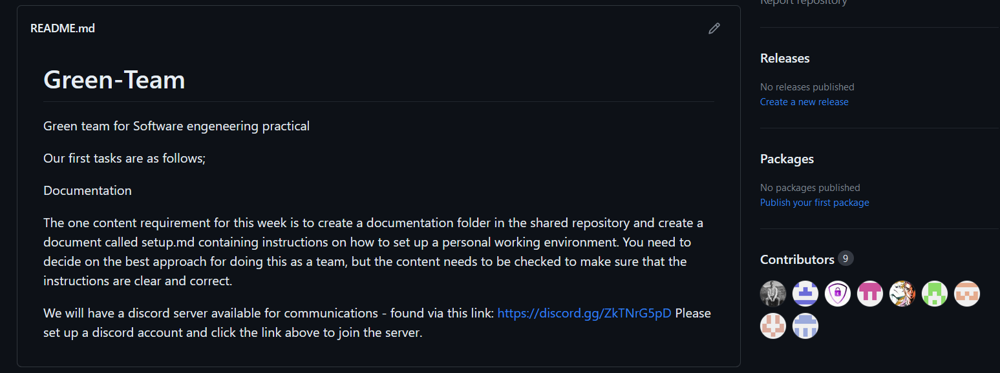
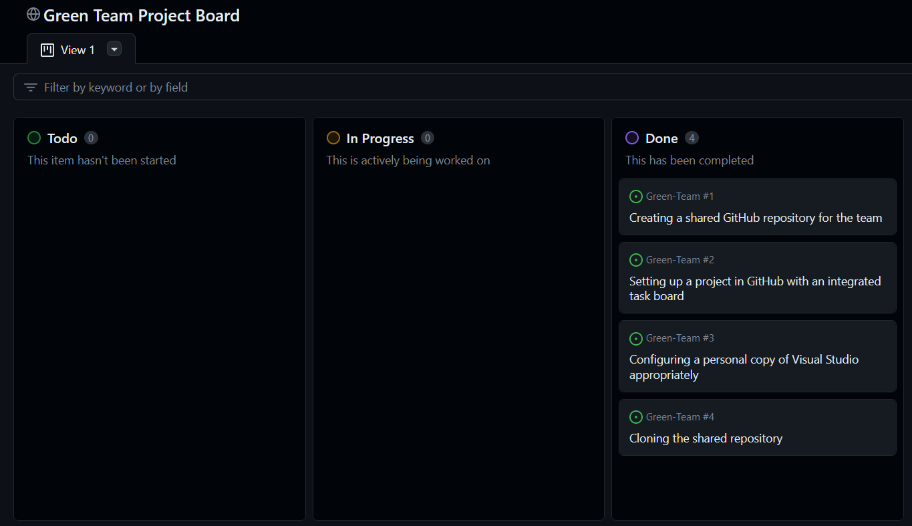
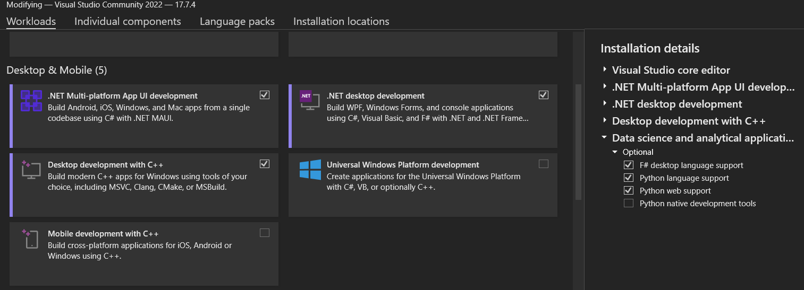
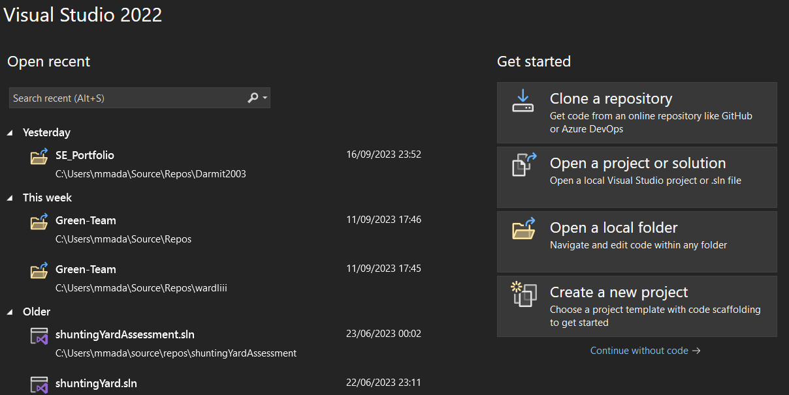
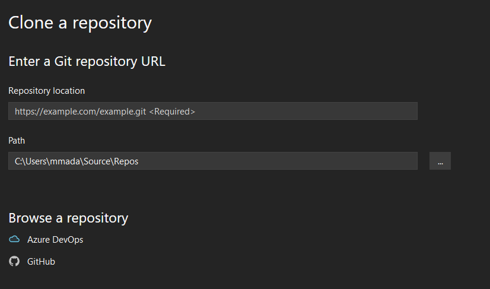
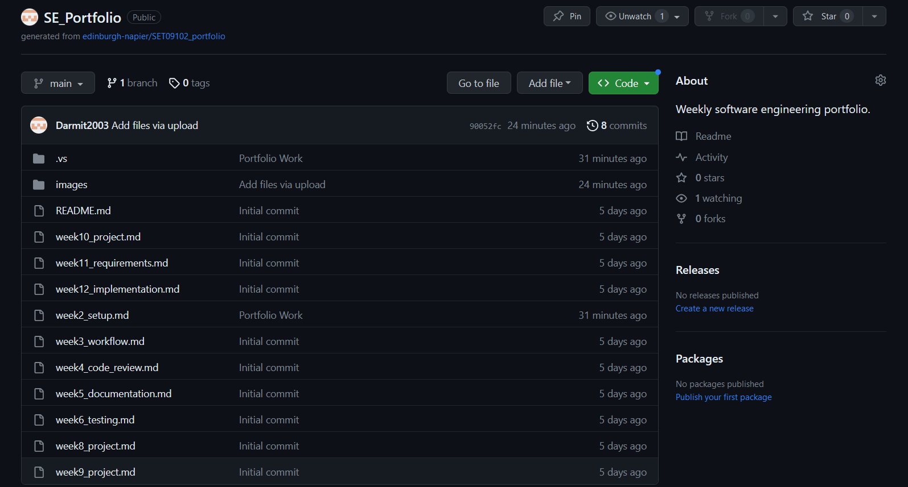

  # Setup

  This section contains documentation on the practical work I carried out in week 2.

  How my environment configuration was setup will be covered as well as my reflection on the work of the week.

  ## Environment Configuration

  <ins>**Shared Team Repo Setup**<ins>
  
  The first task that was undertaken this week as a team was for us to create a shared repository on GitHub and get everyone added as a contributor to the repository.

  |  
  |:--:| 
  <b>Fig.1 - Team Repository Screenshot</b> |

  To achieve this outcome, one of our team members who was more experienced with GitHub created the repository, the rest of us then shared our account emails with this member and he added us to the repository as contributors.

  After this we all had access to our new shared team repository as seen in Fig.1.

  <ins>**Project and Task Board Setup**<ins>
  
  Next we were to setup a project on GitHub with an integrated task board, this again was handled by a few of the team members who were more experienced with GitHub, which at this time does not include myself as this is all completely new to me but I'd like to think I'm learning fairly quickly.

  |  
  |:--:| 
  <b>Fig.2 - Project Board Screenshot</b> |
  
  This task board can be seen set up in a project in Fig.2 above.

  <ins>**Personal Visual Studio Setup**<ins>

  Now onto a more individually based task, I had to configure a personal copy of Visual Studio appropriately to be used for the team's work over the next few weeks.

  |  
  |:--:| 
  <b>Fig.3 - VS Configuration Screenshot</b> |

  I already had a copy of Visual Studio 2019 Community but I thought it would be best to stay up to date with the latest software, so I installed a copy of [Visual Studio 2022 Community](https://visualstudio.microsoft.com/vs/) to use that instead.

  When choosing the packages to install with Visual Studio I made sure to include the package which lets you build using .NET MAUI as this will be needed for future work, this can be seen in Fig.3.

  After installing this my personal copy of Visual Studio was configured appropriately and ready to use.

  <ins>**Cloning the Shared Repository**<ins>

  The last task this week linked to my team was to clone the shared team repository in Visual Studio.

  |  
  |:--:| 
  <b>Fig.4 - Visual Studio Inital Screen Screenshot</b> |

  Upon starting up Visual Studio one of the options you are presented with is to clone a repository, this is in the top right of Fig.4.

  |  
  |:--:| 
  <b>Fig.5 - Visual Studio Cloning Screen Screenshot</b> |

  Fig.5 shows the page you are next presented with, from here I clicked the GitHub button under 'Browse a Repository' and linked Visual Studio to my GitHub account which allowed me to then select the team repository and clone it, meaning I was then able to make changes to files on the repository in VS and then commit the changes to GitHub.

  <ins>**Creating my Personal Portfolio Repository**<ins>

  The final thing that I had to do this week was create my own personal GitHub repository to carry out my portfolio tasks on each week.

  To do this I used a [template repository](https://github.com/edinburgh-napier/SET09102_portfolio/tree/main) provided by my lecturer, and created a new repository with this template so that the basic structure of the repository was already in place.

  I also cloned this repository to Visual Studio, this way I can do my weekly portfolio task as a markdown page, editing it on VS then commiting these changes to the repo on GitHub.

  |  
  |:--:| 
  <b>Fig.6 - Personal Portfolio Repository Screenshot</b> |

  Fig.6 shows my portfolio repository on GitHub.

  # Reflection

  <ins>**Limitations**<ins>

  There are some limiatations to the way the work environment has been configured, for example, I am using the free version of GitHub meaning I have a limited version of the what the full software is capable of.  With the better versions of GitHub you get advanced tools and more storage etc. that my environment cannot access.

  GitHub it's self is known to have limitations in terms of performance as it can be slow in high-traffic times of day, also on the free version I am using I am limited to a file size of 2GB, which shouldn't cause any problems but is a limitation still.

  Like GitHub, one of the limiations of Visual Studio Community is that it is the free version of the software, meaning that there are better versions with premium tools and features that I don't have access to.

  <ins>**Appropriateness**<ins>
  
  I think the way that the work environment has been set up is very appropriate to the current project, considering the fact that we are a team of around 10 people working on a program together it is important to have a way for us to all be able to access and edit our work at any time.

  The problem that this introduces is that we are all working on different devices, in different locations, at different times.  This means we need a way that an individual member can make a change to the program at any time and have these changes saved and shown to the rest of the team as they happen.

  Keeping the work in a repository on GitHub is a great way to do this as it works very well with the IDE we are using (Visual Studio) and it is easy to commit changes made to the project to the current version stored in the repo and then the other team members can sync with the new version of the project and see the changes made in real time.

  Visual Studio is also an appropriate IDE to use when working with the C# language as it has multiple worloads you can install that allow the use of this language with many different types of programs.

  It is also a very easy to use IDE in general, it is well laid out and has hundreds of extensions you can add on to the IDE to make your experience better.

  <ins>**Alternatives**<ins>

  Of course the way that we have set up the work environment is not the only way to do so, there are other IDEs as well as other repository sites that could be used as substitutes for what we have chosen.

  There are other repository sharing sites like JFrog that can be used as well as other file sharing sites like DropBox that are appropriate alternatives to our configuration, although what gives GitHub a leg up in our situation is that some of the team are already familiar with it making it easier for them to teach the poeple like me who don't know how to use it which saves time on learning new software.

  Eclipse is an example of another IDE we could have used in our configuration in place of Visual Studio and which works with C# and links to GitHub making it an appropriate alternative for the work environment.

  <ins>**Difficulties**<ins>

  There were a few difficulties when it came to setting up the work environment, mainly because I had never used GitHub before this week so it was entirely new to me and I thought it was a steep learning curve.

  Even something as simple as creating a repository seemed challenging at first but with help from some of the more experienced members of the team in combination with some resarch and YouTube videos I managed to overcome the hurdle of learning GitHub and managed to complete all of the tasks of the week.

  I do still feel I have some things to learn though and will be looking to improve on my knowledge and skills within GitHub over the next few weeks.