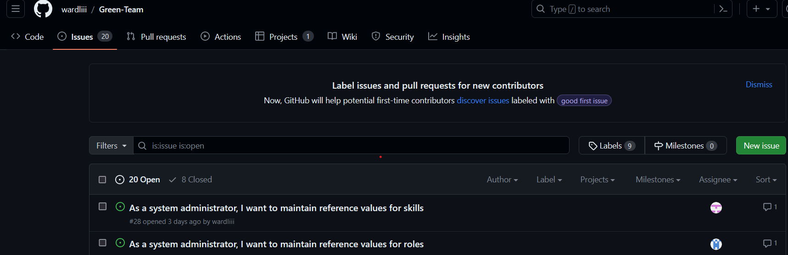
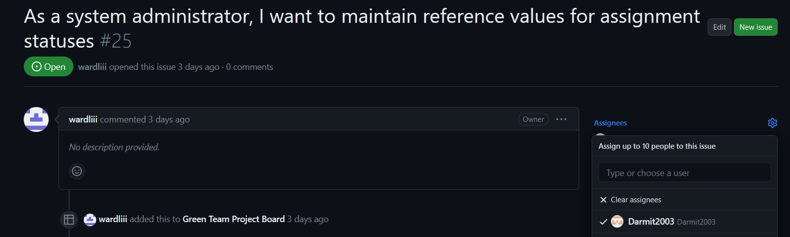

# Workflow

This section documents your practical work in week 3.

The main requirements are to show that:

1. You know how to use the workflow tools in GitHub
2. You have successfully carried out the required operations which are:
   * Accept a task from the project backlog
   * Update the task information appropriately
   * Update the task board appropriately
   * Complete the development task on a feature branch
   * Commit your changes with appropriate comments
   * Check your work against the Definition of Done (DoD)
   * Make a pull request

## Task workflow

Here, you should use screenshots and descriptive commentary to show that the required
have been completed successfully.

**DO**

* Consider the layout of your content from the point of view of the reader. Many raw
  screenshots will take up a lot of space. It may be better to adopt a different strategy
  such as
  * Using thumbnails with links to full-size images
  * Combining two or more screenshots into a single image 
  * Using partial screenshots to highlight only the important information
  * etc.
* Provide links to the actual objects (e.g. task, pull request, etc.) in the team project
  in GitHub
* Read through your work to make sure that the information comes across clearly

**DON'T**

* Use humour or informal language
* Waste space with trivial or self-evident commentary
* Abbreviate your commentary using (e.g. by using bullet points). Your text should be in
  the form of grammatically correct sentences.

## Reflection

Here, you should highlight any difficulties that you faced in completing the task, and
how you resolved them.

You should also briefly discuss the current process and how it could be refined or
improved in future iterations. For example, is the DoD adequate or too onerous? Is the
current procedure for updating the task appropriate? Is the task board configured to
work in an intuitive way?

# Workflow

The following section contains documentation on the practical work I carried out in week 3.

I will prove I know how to use the workflow tools in GitHub and can carry out the required operations to complete a task following this workflow.

## Workflow Task

### Workflow tools in GitHub

There are many tools that are valuable to use in the process of our team's workflow, which we decided to base on the standard GitHub flow.

Also in our workflow any tasks to be completed will be on our team's project board, when we create a branch to make a change, we will assign ourseleves to this task on GitHub and move the task to 'In Progress' on the board.

Once we have made our changes and merged our branch and deleted it we would then move the task to 'Done' on the board.

To summarise, this involves:

1. Creating a branch
1. Assigning and moving the task
1. Making your code changes
1. Creating a pull request
1. Adressing review comments
1. Merging the pull request
1. Deleting the branch
1. Marking the task as done

To carry out this workflow successfully GitHub will be used as a repository to contain our work but more specifically, the GitHub project board and 'Issues' section of the repository will be used to assign to tasks and update their status.

GitHub will also be used to review pull requests from other team members.  Any code changes and branches made will be carried out on Visual Studio as the team has already cloned the repository onto their own copies.

We will use Discord for any additional communication that is required between memebers of the team outside of the time we will spend collaborating on campus.

### Required Operations

<ins>**Accepting a Task**<ins>

To accept a task from the project backlog I navigate to the 'Issues' section of our team repository where the tasks are listed shown here:

|  
  |:--:| 
  <b>Fig.1 - Team Issues Screenshot</b> |

After clicking on an issue there is an assignees tab where I found my name and then assigned myself to the task shown in Fig.2.

|  
  |:--:| 
  <b>Fig.1 - Task Assignment Screenshot</b> |

<ins>**Updating Task Information**<ins>

