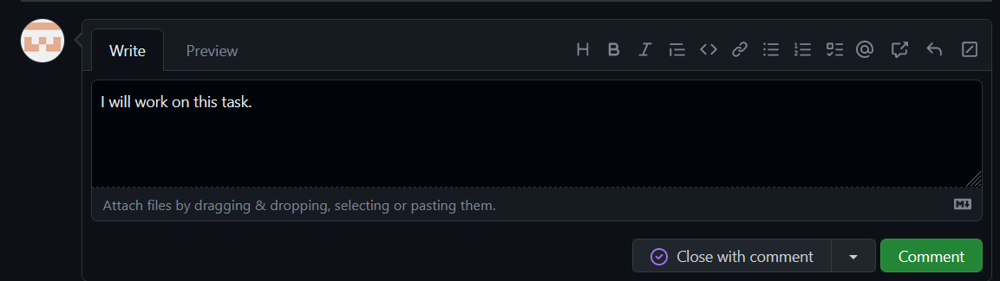
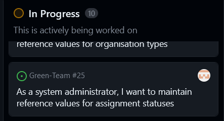
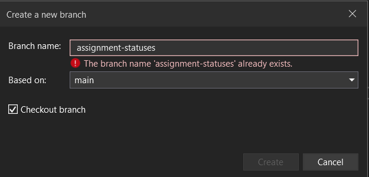
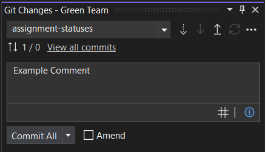
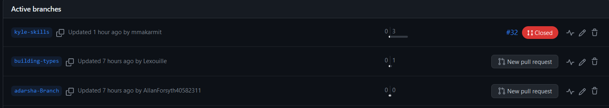

# Workflow

The following section contains documentation on the practical work I carried out in week 3.

I will prove I know how to use the workflow tools in GitHub and can carry out the required operations to complete a task following this workflow.

## Workflow Task

### Workflow tools in GitHub

There are many tools that are valuable to use in the process of our team's workflow, which we decided to base on the standard GitHub flow.

Also in our workflow any tasks to be completed will be on our team's project board, when we create a branch to make a change, we will assign ourseleves to this task on GitHub and move the task to 'In Progress' on the board.

Once we have made our changes and merged our branch and deleted it we would then move the task to 'Done' on the board.

To summarise, this involves:

1. Creating a branch
1. Assigning and moving the task
1. Making your code changes
1. Creating a pull request
1. Adressing review comments
1. Merging the pull request
1. Deleting the branch
1. Marking the task as done

To carry out this workflow successfully GitHub will be used as a repository to contain our work but more specifically, the GitHub project board and 'Issues' section of the repository will be used to assign to tasks and update their status.

GitHub will also be used to review pull requests from other team members.  Any code changes and branches made will be carried out on Visual Studio as the team has already cloned the repository onto their own copies.

We will use Discord for any additional communication that is required between memebers of the team outside of the time we will spend collaborating on campus.

### Required Operations

<ins>**Accepting a Task**<ins>

To accept a task from the project backlog I navigate to the 'Issues' section of our team repository where the tasks are listed shown here:

|  
  |:--:| 
  <b>Fig.1 - Team Issues Screenshot</b> |

After clicking on an issue there is an assignees tab where I found my name and then assigned myself to the task shown in Fig.2.

|  
  |:--:| 
  <b>Fig.2 - Task Assignment Screenshot</b> |

<ins>**Updating Task Information**<ins>

Updating the task information can be done from the same page where I assigned myself to the task, as directly to the left of the assignees box there is a comments box, in which I can add some information to say that I am taking on this task which makes it clear to the rest of my team.

|  
  |:--:| 
  <b>Fig.3 - Update Info Screenshot</b> |

<ins>**Updating the Task Board**<ins>

Updating the task board appropriately turned out to be an unexpected challenge as I could not figure out how to do what should have been quite easy.

I later found out that this was because the team member that created our shared repository had made a mistake that led to everyone else not having the permission to move tasks on the project board.

After talking to the team I had someone on the team move the task across for me once I had assigned myself to it.  Fig.4 shows my task in the 'In Progress' section after my team member moved it.

|  
  |:--:| 
  <b>Fig.4 - Task Board Screenshot</b> |

<ins>**Completing the Development Task**<ins>

This section should cover completing my assigned task on a feature branch, however, I have not yet been able to complete my task due to both the main branch of the shared repository being broken and not letting me branch from it, as well as not being able to successfully integrate SQLite with a MAUI app yet.

Due to this all that I can show in this section is that eventually I was able to create a new branch to complete my development task on, which of course I cannot show completed at this time but I will continue to work on.

In Fig.5 you can see the create branch pop-up, which I accessed by selecting 'Git Changes' next to the solution explorer in Visual Studio and then pressing the 'New Branch' button.

|  
  |:--:| 
  <b>Fig.5 - Task Board Screenshot</b> |

This new branch is called 'assignment-statuses' and it is based on the main branch.  The reason it says it already exists is I had already created the branch and done this again for screenshot evidence purposes.

<ins>**Commiting Changes**<ins>

Since as already mentioned my development task is not completed I can't commit the changes of this task working but I can still show evidence of the fact that I do know how to commit changes with comments for when I do manage to complete my task.

Once my development task is completed and I am happy that it is working, I will go to the 'Git Changes' section mentioned in the previous step.  Here there is a box prompting me to enter a message this is where the comments go for the commit.  In Fig.6 you can see I have entered 'Example Comment' to show how it works.

Next I would press 'Commit All' to commit my changes in this branch.

|  
  |:--:| 
  <b>Fig.6 - Commit Screenshot</b> |

<ins>**Checking Against the DoD**<ins>

If I had completed my development task this is the point where I would check my work against the Definition of Done (Dod).  The DoD is a checklist of requirements that the development task would be checked against to ensure that it is ready to be signed off as complete and merged into the main branch.

The DoD includes requirements such as:

 - All criteria is met
  - Adequate testing is carried out
   - There are no known issues

<ins>**Making a Pull Request**<ins>

The final step for the development task this week would be to make a pull request, this allows the code in this branch to be reviewed by someone on the team and leave review comments.

After these comments have been addressed so that this branch will not conflict with the main, this branch could then be merged with the main and then deleted.

Fig.7 shows some active branches on the shared repository and the button to make a pull request once the changes have been comitted.

|  
  |:--:| 
  <b>Fig.7 - Pull Request Screenshot</b> |

# Reflection

This week was very challenging in my opinion, as I feel there was a lot of ambiguity on what was actually required this week and what wasn't and just figuring out what the real task was took a lot of time and effort.

My team as a whole was very confused and most were in the same boat as me.  C#, MAUI apps, SQLite databases and GitHub were all things I had never used only 2 weeks ago so the learning curve has been steep, and all or most of these technologies are new to everyone on my team as well so trying to get help has been near impossible.

The Microsoft tutorial on SQLite we were linked is very unintuitive to the point where after hours of trying to make sense of it, I had to give up on it and try to find another method of teching myself how to integrate SQLite.

After many hours spent, videos watched and forums read I am still no further ahead.  Communication with members of the team didn't lead to much help as everyone else was just as confused and were trying to put out their own fires while also trying to fix the issues we had on our team repo.

I made the decision to hand this work in a day late and lose a mark hoping that some in person commucation and team work would lead to some clarity and while some progress was made I still wasn't ready to complete my development task yet which is the situation the rest of the team members find themselves in as well.

While progress is being made it feels like it is not fast enough to keep up with schedule and although I overcame some of my struggles more problems are still in the way of completion.
